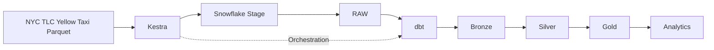
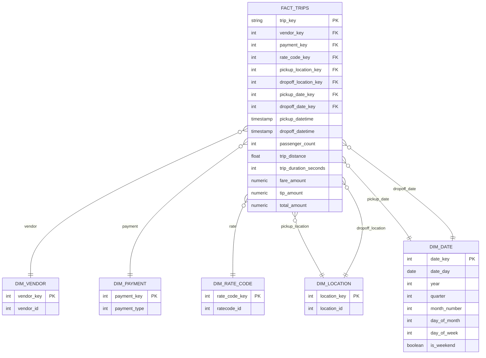

# Laboratorio Integrador I — NYC Yellow Taxi ELT Pipeline

Pipeline ELT reproducible para procesar datos de **NYC Yellow Taxi** utilizando **Kestra**, **Snowflake** y **dbt**.

La solución permite levantar la infraestructura local, ingerir automáticamente los archivos originales de NYC TLC hacia Snowflake y construir las capas **Bronze**, **Silver** y **Gold** mediante dbt.

## Arquitectura

El pipeline sigue la siguiente arquitectura:



Responsabilidades principales:

- **Kestra**: bootstrap de infraestructura, descarga de archivos, carga hacia Snowflake y ejecución de dbt.
- **Snowflake**: almacenamiento y ejecución de consultas.
- **dbt**: transformación de RAW hacia Bronze, Silver y Gold, además de las pruebas de calidad.

## Datos procesados

Se utilizan los archivos públicos de **NYC TLC Yellow Taxi Trip Records**.

El pipeline procesa los meses disponibles incluidos en el laboratorio:

```text
2025-01 ... 2025-12
2026-01 ... 2026-07
```

En total:

```text
19 archivos mensuales
```

Los archivos son obtenidos directamente desde:

```text
https://d37ci6vzurychx.cloudfront.net/trip-data/
```

Por ejemplo:

```text
yellow_tripdata_2025-01.parquet
```

## Capas de datos

### RAW

La capa RAW conserva cada registro original como `VARIANT` junto con metadata de ingesta.

Tabla:

```text
NYC_TAXI.RAW.YELLOW_TAXI_TRIPS
```

Esquema:

```text
raw_record
_source_file
_source_row_number
_ingested_at
```

La ingesta utiliza un `MERGE` cuya identidad está formada por:

```text
_source_file + _source_row_number
```

Esto permite volver a ejecutar el pipeline sin duplicar registros.

### Bronze

Modelo:

```text
BRZ_YELLOW_TAXI_TRIPS
```

Bronze conserva el registro original y estandariza la metadata de origen:

```text
raw_record
source_file
source_row_number
source_period
loaded_at
```

Se materializa como una **view**.

### Silver

Modelo:

```text
SLV_YELLOW_TAXI_TRIPS
```

Silver contiene viajes tipados, deduplicados y filtrados según las reglas de calidad definidas para el laboratorio.

Entre las transformaciones realizadas se encuentran:

- conversión de tipos;
- eliminación de duplicados exactos;
- validación de campos requeridos;
- eliminación de registros con valores nulos en los campos requeridos;
- normalización de `store_and_fwd_flag`;
- validación de duración del viaje;
- validación del período del archivo;
- validación de distancias, pasajeros, ubicaciones e importes;
- cálculo de `trip_duration_seconds`;
- generación de `trip_key`.

Silver se materializa como una **table**.

## Gold

Gold implementa un esquema estrella orientado al análisis de viajes.



### Grano de la tabla de hechos

Una fila de:

```text
FACT_TRIPS
```

representa **un viaje limpio y deduplicado presente en Silver**.

La clave primaria lógica es:

```text
trip_key
```

Las principales métricas disponibles incluyen:

```text
passenger_count
trip_distance
trip_duration_seconds
fare_amount
extra
mta_tax
tip_amount
tolls_amount
improvement_surcharge
congestion_surcharge
airport_fee
cbd_congestion_fee
total_amount
```

## Estructura del proyecto

```text
.
├── analyses/
├── dbt_project.yml
├── docker-compose.yml
├── Dockerfile
├── instructions.md
├── kestra/
│   └── flows/
│       └── main_company.team_elt_taxi_satt.yml
├── macros/
│   └── generate_schema_name.sql
├── models/
│   ├── bronze/
│   │   ├── brz_yellow_taxi_trips.sql
│   │   └── sources.yml
│   ├── silver/
│   │   ├── schema.yml
│   │   └── slv_yellow_taxi_trips.sql
│   └── gold/
│       ├── dim_date.sql
│       ├── dim_location.sql
│       ├── dim_payment.sql
│       ├── dim_rate_code.sql
│       ├── dim_vendor.sql
│       ├── fact_trips.sql
│       └── schema.yml
├── README.md
├── seeds/
├── snapshots/
└── tests/
```

## Requisitos

Se requiere:

- Docker;
- Docker Compose;
- una cuenta de Snowflake;
- acceso de red a NYC TLC;
- credenciales de Snowflake con permisos para crear warehouse, database, schemas, stages y tablas.

No se requiere una cuenta de dbt Cloud.

La solución utiliza **dbt Core** dentro del contenedor de Kestra.

## Configuración

Crear un archivo `.env` en la raíz del proyecto.

Ejemplo:

```env
K_POSTGRES_DB=kestra
K_POSTGRES_USER=kestra
K_POSTGRES_PASSWORD=kestra

K_USER=admin
K_PASSWORD=admin

SNOWFLAKE_ACCOUNT=<account_identifier>
SNOWFLAKE_USER=<username>
SNOWFLAKE_PASSWORD=<password>
SNOWFLAKE_ROLE=<role>

SNOWFLAKE_WAREHOUSE=COMPUTE_WH
SNOWFLAKE_DATABASE=NYC_TAXI

SNOWFLAKE_RAW_SCHEMA=RAW
SNOWFLAKE_BRONZE_SCHEMA=BRONZE
SNOWFLAKE_SILVER_SCHEMA=SILVER
SNOWFLAKE_GOLD_SCHEMA=GOLD
```

El archivo `.env` no debe almacenarse en Git.

## Ejecución desde cero

### 1. Clonar el repositorio

```bash
git clone <URL_DEL_REPOSITORIO>
cd <DIRECTORIO_DEL_LABORATORIO>
```

### 2. Crear `.env`

Crear el archivo descrito en la sección anterior con las credenciales correspondientes.

### 3. Construir los contenedores

```bash
docker compose build
```

La imagen personalizada de Kestra instala:

```text
dbt Core
dbt-snowflake
git
```

### 4. Levantar Kestra

```bash
docker compose up -d
```

La interfaz web estará disponible en:

```text
http://localhost:8080
```

Realizar autenticación con `K_USER` y `K_PASSWORD`

### 5. Ejecutar el flow

En Kestra, ejecutar:

```text
company.team.elt_taxi_satt
```

El flujo realiza automáticamente:

```text
1. Creación del warehouse
2. Creación de la base de datos
3. Creación de RAW, BRONZE, SILVER y GOLD
4. Creación del Snowflake Stage
5. Creación del formato Parquet
6. Creación de la tabla RAW
7. Descarga de los 19 archivos mensuales
8. Upload de cada archivo al Stage
9. MERGE idempotente hacia RAW
10. Eliminación del archivo temporal descargado
11. Ejecución de dbt build
12. Construcción de Bronze
13. Construcción de Silver
14. Construcción de Gold
15. Ejecución de las pruebas dbt
```

El task `dbt_build` se ejecuta una sola vez después de que finaliza la ingesta de todos los períodos.

## Ejecución de dbt

Kestra ejecuta:

```bash
dbt build
```

sobre el proyecto montado en:

```text
/workspace/project
```

Los artifacts y logs de dbt son escritos en `/tmp` para mantener el repositorio montado como read-only.

`dbt build` construye los modelos en orden de dependencia y ejecuta sus pruebas.

## Pruebas de calidad

Los modelos dbt incluyen pruebas de:

```text
not_null
unique
relationships
accepted_values
```

Entre otras validaciones:

- `trip_key` es único y no nulo;
- las claves primarias de dimensiones son únicas;
- las foreign keys de `FACT_TRIPS` tienen correspondencia con sus dimensiones;
- las claves utilizadas para análisis no son nulas;
- `store_and_fwd_flag` acepta únicamente los valores permitidos.

## Reproducibilidad e idempotencia

El pipeline puede ejecutarse múltiples veces.

La capa RAW utiliza:

```sql
MERGE
```

con:

```text
_source_file
_source_row_number
```

como identidad del registro, evitando duplicados durante una nueva ejecución.

Las capas Bronze, Silver y Gold son reconstruidas por dbt a partir del estado de RAW.

Por tanto, una nueva ejecución completa converge nuevamente al mismo estado lógico mientras los archivos fuente y las reglas de transformación no cambien.

## Validación de una instalación desde cero

Para comprobar la reproducibilidad puede eliminarse la base de datos:

```sql
DROP DATABASE IF EXISTS NYC_TAXI;
```

y volver a ejecutar únicamente el flow de Kestra.

Al finalizar deben existir:

```text
NYC_TAXI
├── RAW
│   └── YELLOW_TAXI_TRIPS
│
├── BRONZE
│   └── BRZ_YELLOW_TAXI_TRIPS
│
├── SILVER
│   └── SLV_YELLOW_TAXI_TRIPS
│
└── GOLD
    ├── DIM_DATE
    ├── DIM_LOCATION
    ├── DIM_PAYMENT
    ├── DIM_RATE_CODE
    ├── DIM_VENDOR
    └── FACT_TRIPS
```

Una ejecución exitosa desde ese estado demuestra que la infraestructura, ingesta, transformaciones y pruebas pueden reproducirse utilizando únicamente el repositorio, Docker, las credenciales de Snowflake y las fuentes públicas.

## Resultado

El pipeline produce las tres capas requeridas:

```text
RAW
 ↓
BRONZE
 ↓
SILVER
 ↓
GOLD
```

Gold queda listo para realizar análisis por:

- fecha;
- vendor;
- forma de pago;
- rate code;
- ubicación de origen;
- ubicación de destino;

y calcular métricas relacionadas con volumen de viajes, distancias, duración, pasajeros, tarifas, propinas y montos totales.